<div align="center">

# 🔐 VeriRag: Cloud-Native Faithful RAG System

### *Enterprise-Grade Document Intelligence with Hallucination Prevention*

[](https://github.com/VaibhavKumar2005/cloud-native-ai-library-system)
[](https://kubernetes.io/)
[](https://argo-cd.readthedocs.io/)
[](https://ai.google.dev/)


[Quick Start](#-quick-start) • [Architecture](#-how-it-works) • [Deployment](#-deployment)

</div>

---

## 🎯 What is VeriRag?

An **AI Librarian** that prevents hallucinations through a **"Trust but Verify"** pipeline. Every AI response is validated against source documents with a faithfulness score (0.0-1.0). Answers below 0.7 are automatically rejected.

### 🔄 How It Works

```mermaid
graph LR
    A[📝 Query] --> B[🔍 Vector Search]
    B --> C[🤖 AI Generation]
    C --> D[🔬 Critic Verification]
    D --> E{Score ≥ 0.7?}
    E -->|Yes| F[✅ Deliver]
    E -->|No| G[❌ Reject]
```



**Pipeline:** Query → Vector Search (pgvector) → Generate Answer (Gemini) → Verify (Critic Agent) → Score & Deliver

---

## ⚡ Key Features

- **🎯 Hallucination Prevention** - Dual-agent verification with faithfulness scoring
- **☁️ Cloud-Native** - Kubernetes-ready with GitOps (Argo CD) & IaC (Terraform)
- **📊 Observability** - Prometheus + Grafana monitoring stack
- **🚀 Production-Ready** - PostgreSQL pgvector, async Django, React 19 UI

---

## 🏗️ Tech Stack

**Frontend:** React 19 + Vite | **Backend:** Django REST | **Database:** PostgreSQL + pgvector  
**AI:** Google Gemini 1.5 Flash | **Infra:** Kubernetes (AKS) + Terraform | **GitOps:** Argo CD  
**Monitoring:** Prometheus + Grafana | **Secrets:** HashiCorp Vault

---

## � Quick Start

### Prerequisites
- Docker & Docker Compose
- Google Gemini API Key ([Get it here](https://ai.google.dev/))

### Run Locally

```bash
# 1. Clone the repository
git clone https://github.com/VaibhavKumar2005/cloud-native-ai-library-system.git
cd cloud-native-ai-library-system

# 2. Set up environment
cp .env.example .env
# Edit .env and add your GEMINI_API_KEY

# 3. Launch the stack
docker-compose up --build -d

# 4. Initialize database
docker-compose exec backend python manage.py migrate
docker-compose exec backend python setup_pgvector.py
```

### Access Services

| Service | URL |
|---------|-----|
| 🌐 Web App | [localhost:5173](http://localhost:5173) |
| 📡 API Docs | [localhost:8000/api/schema/swagger-ui/](http://localhost:8000/api/schema/swagger-ui/) |
| 📊 Prometheus | [localhost:9090](http://localhost:9090) |
| 📈 Grafana | [localhost:3000](http://localhost:3000) (admin/admin) |

---

## ☸️ Deployment

### Minikube (Local K8s)

```bash
minikube start --memory=4096 --cpus=2
kubectl apply -f infrastructure/k8s/
minikube service frontend --url
```

### Azure Kubernetes Service (AKS)

```bash
# Provision with Terraform
cd infrastructure && terraform init && terraform apply

# Get AKS credentials
az aks get-credentials --resource-group verirag-rg --name verirag-aks

# Deploy with kubectl
kubectl apply -f k8s/
```

### GitOps with Argo CD

```bash
# Install Argo CD
kubectl create namespace argocd
kubectl apply -n argocd -f https://raw.githubusercontent.com/argoproj/argo-cd/stable/manifests/install.yaml

# Connect repository
argocd app create verirag \
  --repo https://github.com/VaibhavKumar2005/cloud-native-ai-library-system.git \
  --path infrastructure/k8s \
  --dest-server https://kubernetes.default.svc \
  --sync-policy automated
```

**Result:** Every push to `main` auto-deploys to your cluster!

---

## 📊 Monitoring

Access Grafana at `localhost:3000` (admin/admin) for:

- **🎯 Faithfulness Trends** - Real-time accuracy scores
- **⚡ Vector Search Performance** - pgvector latency tracking  
- **🏥 System Health** - CPU/Memory usage & auto-scaling triggers
- **🤖 AI Metrics** - Token usage & response times

Prometheus alerts configured for:
- High rejection rates (>30% queries rejected)
- Slow vector searches (p95 > 2s)
- System resource exhaustion

---

## �️ Project Structure

```
backend/          # Django API + RAG pipeline
├── ai_engine/    # Core RAG logic & faithfulness verification
├── librarian/    # PDF ingestion & chunking
└── verifier/     # Critic agent implementation

frontend/         # React UI
infrastructure/   # Terraform + Kubernetes manifests
vault/            # HashiCorp Vault config
```

---

## 👨‍💻 Author

**Vaibhav Kumar** - Cloud-Native & AI Engineer

[](https://github.com/VaibhavKumar2005)
[](https://linkedin.com/in/vaibhavkumar)

*Building scalable, verifiable AI systems on Azure*

---

## 📄 License

MIT License - see [LICENSE](LICENSE) file for details.

---

<div align="center">

**⭐ Star this repo if you find it useful!**

[Report Bug](https://github.com/VaibhavKumar2005/cloud-native-ai-library-system/issues) • [Request Feature](https://github.com/VaibhavKumar2005/cloud-native-ai-library-system/issues)

</div>